# Item Database

## Purpose

This document explains the item database (also called the parts library or component library): what it stores, where the data lives, how the tables relate to each other, and the full column reference for every table.

The item database is the master catalog of physical parts used to build cable harnesses — contacts, wires, sleeves/tubes/braids, labels, backshells, strain reliefs, modules (connector bodies), splices, and frames (ITA/Receiver housings). Designs reference these parts by part number / part ID, the BOM generator resolves quantities against them, and the validator uses their attributes and compatibility rules to flag design problems.

It is managed in the admin UI ("Item Database" viewer plus the compatibility manager) and exposed over the `/v1/library/*` API.

## Where Data Is Stored

The API server selects a storage backend at startup via the `STORE_BACKEND` environment variable (`src/server.ts`). All backends implement the same `Store` interface (`src/infra/store/store.ts`), so the application logic is identical regardless of backend.

| Backend | Selected by | Where item data lives | Notes |
| --- | --- | --- | --- |
| SQLite | `STORE_BACKEND=sqlite` (default when unset) + optional `SQLITE_PATH` (default `data/app.db`) | A single JSON blob | **Local durable default.** `SqliteStore` extends `MemoryStore` and serializes the entire in-memory state into one row (`id = 'memory_store'`) of an `app_state` table after each write. The relational schema below does **not** apply to SQLite. |
| Postgres | `STORE_BACKEND=postgres` + `DATABASE_URL` | Normalized relational tables (described in this document) | Production path. Schema is created by SQL migrations through `029`. |
| Memory | `STORE_BACKEND=memory` | In-process `Map`s, lost on restart | Tests / explicit ephemeral runs only. |

The API loads a project `.env` file at startup (`src/infra/env/load-dotenv.ts`) without overriding shell-set variables. Copy `.env.example` to `.env` for local defaults.

The catalog is a **global shared item database**: parts created (and reviewed) on this store are visible to other users of the same API/database and usable across projects. Separate SQLite files do not sync; use one shared DB (or Postgres) for multi-user sharing.

CPQMatricesInfo workbook load into this catalog is available via `npm run import:cpq` (see `scripts/import-cpq.ts` and `docs/cpq-import-report.md`). Schema readiness for that load is migration `028`. VPC i1/iCon product-catalog load is `npm run import:vpc-catalog` (`scripts/import-vpc-catalog.ts`), which writes PARTS and COMPATIBILITY rows straight to Postgres (`DATABASE_URL`) after migration `029`.

Postgres schema changes are plain `.sql` files in `db/migrations/`, applied in filename order by `npm run migrate` (`scripts/migrate.ts`), which tracks applied files in a `schema_migrations` table. The item model was introduced by `027_parts_model.sql`, corrected for CPQ ingest readiness by `028_parts_model_cpq_readiness.sql`, and extended for VPC i1/iCon catalog readiness by `029_vpc_catalog_readiness.sql`.

> History: migration 027 replaced the earlier flat `library_components` table and its EAV companions (`library_field_definitions`, `library_component_custom_values`) with the typed schema described here. Existing catalog rows were intentionally discarded (no data migration). Migration 028 adds CPQ-required selection, provenance, and child tables. Migration 029 adds VPC shared taxonomy, the `frame` category, module/contact extensions, and `part_relationships`. The web viewer still normalizes the legacy category name `connector` to `contact` when it encounters old records.

## Storage Design

The schema uses a **base table + typed extension tables** pattern (class-table inheritance):

1. **`parts`** holds identity, lifecycle, and audit fields shared by every item, plus a `category` discriminator.
2. **One extension table per category** (`modules`, `contacts`, `wires`, `labels`, `sleeve_tube_braids`, `backshells`, `strain_reliefs`, `splices`, `frames`) holds the category-specific attributes. Each extension row shares its primary key with `parts.id` (a strict 1:1 relationship).
3. **`part_aliases`** maps external part-numbering systems (legacy 3-digit codes, PC Designer codes, etc.) onto parts.
4. **Four compatibility junction tables** record pairwise allowed/forbidden/review relationships between specific parts; **`part_relationships`** stores position-scoped generic rules (frame slots, pin groups, SIM inserts, gauge/media) without adding a new junction per relationship type. Supporting child/reference tables retain multi-valued selection facts and ingest provenance.

Important characteristics:

- **IDs are application-generated strings** (`parts.id` is `TEXT`; e.g. ingest accepts an optional caller-supplied ID). There is no DB-side ID generation.
- **The category ↔ extension match is enforced at the application layer**, not by the database. The store inserts a `parts` row and then the matching extension row inside one transaction.
- **Compat junctions are category-safe at the DB level**: they reference the extension tables (e.g. `contacts(part_id)`), not `parts`, so a compat row literally cannot point at a part of the wrong category.
- **Soft delete via archiving**: `is_archived = TRUE` hides a part from normal listings but keeps the row (restorable from the admin UI). A hard `DELETE` is also available and cascades to extension, alias, and compat rows.
- **Identity uniqueness**: `(category, part_number)` must be unique among non-archived parts (partial unique index). `family` remains required for filtering/display; archived parts do not block reuse of an identity.
- **Naming convention**: database columns are `snake_case`; the domain layer maps them to `camelCase` fields (e.g. `accepted_awg_min` ↔ `acceptedAwgMin`). JSONB list columns map to string arrays (`pin_ids_json` ↔ `pinIds`, `accepted_families_json` ↔ `acceptedFamilies`).

### Categories

`parts.category` must be one of:

`contact`, `wire`, `sleeve-tube-braid`, `label`, `backshell`, `strain-relief`, `module`, `splice`, `frame`

Each category corresponds to exactly one extension table (see column reference below).

### Part lifecycle

The UI-facing lifecycle status is derived from three boolean columns (`resolveLibraryLifecycleStatus` in `src/domain/library.ts`):

| Status | Condition | Meaning |
| --- | --- | --- |
| `draft` | `is_reviewed = FALSE` | Newly entered, awaiting review (appears in the review queue). |
| `reviewed_active` | reviewed and `is_active = TRUE` | Approved and usable in designs. |
| `inactive` | reviewed and `is_active = FALSE` | Approved but deactivated (hidden from default listings). |
| `archived` | `is_archived = TRUE` | Soft-deleted; excluded from listings and from the identity uniqueness rule. |

Separately, `stock_status` tracks availability: `in_stock`, `low_stock`, `out_of_stock`, or `unknown`.

## Relationships

```mermaid
erDiagram
    parts ||--o| modules : "1:1 when category=module"
    parts ||--o| contacts : "1:1 when category=contact"
    parts ||--o| wires : "1:1 when category=wire"
    parts ||--o| labels : "1:1 when category=label"
    parts ||--o| sleeve_tube_braids : "1:1 when category=sleeve-tube-braid"
    parts ||--o| backshells : "1:1 when category=backshell"
    parts ||--o| strain_reliefs : "1:1 when category=strain-relief"
    parts ||--o| splices : "1:1 when category=splice"
    parts ||--o| frames : "1:1 when category=frame"

    parts ||--o{ part_aliases : "external codes"
    parts ||--o{ part_import_provenance : "source rows"
    parts ||--o{ part_components : "parent assembly"
    parts ||--o{ part_relationships : "generic rules"
    modules ||--o{ module_contact_positions : "contact-size positions"
    sleeve_tube_braids ||--o{ sleeve_size_ranges : "diameter bands"
    backshells ||--o{ backshell_fitments : "fitments"

    contacts ||--o{ contact_wire_compat : ""
    wires ||--o{ contact_wire_compat : ""
    modules ||--o{ module_contact_compat : ""
    contacts ||--o{ module_contact_compat : ""
    modules ||--o{ module_backshell_compat : ""
    backshells ||--o{ module_backshell_compat : ""
    modules ||--o{ module_strain_relief_compat : ""
    strain_reliefs ||--o{ module_strain_relief_compat : ""

    modules }o--o| parts : "default_protective_cover_part_id"
    backshells }o--o| parts : "keying_part_id"
    strain_reliefs }o--o| parts : "related_module_hint_part_id"
```

Four kinds of relationships exist:

1. **Extension (1:1)** — every part has exactly one extension row in the table matching its category. `ON DELETE CASCADE` from `parts`, so deleting a part removes its extension row (and, transitively, its compat rows).
2. **Cross-part reference columns (soft pointers)** — a few extension columns point at other parts (`default_protective_cover_part_id`, `keying_part_id`, `related_module_hint_part_id`), while `sleeve_size_ranges.related_part_id` points to an optional paired part. All are nullable with `ON DELETE SET NULL`, so removing the referenced part just clears the pointer.
3. **Compatibility junctions (many-to-many)** — pairwise rules between two specific parts with a status of `allowed`, `forbidden`, or `review`. Managed in the admin compatibility manager, consumed by the validator via `createCompatLookup` (`src/domain/compat-lookup.ts`).
4. **Generic relationships** — `part_relationships` rows scoped by `relationship_type`, optional child part, and `parent_positions_json` (slots, pin groups, SIM sections, gauges). New relationship types do not need a new SQL table. Canvas connector picking uses `category === "module"` and `partType === "MODULE"` so frames and SIM inserts stay out of the top-level picker.

Alias rows form a fourth, simpler relationship: many aliases per part, with `(code_system, code)` globally unique — a given code within a code system resolves to exactly one part. The BOM builder (`src/domain/bom.ts`) uses aliases to resolve legacy part numbers found in design snapshots.

## Column Reference

### `parts` (base table, all categories)

| Column | Type | Nullable | Default | Notes |
| --- | --- | --- | --- | --- |
| `id` | TEXT | no | — | Primary key. Application-generated string ID. |
| `category` | TEXT | no | — | CHECK: one of the nine categories listed above. Determines the extension table. |
| `part_number` | TEXT | no | — | Manufacturer/internal part number. Part of the active identity. |
| `family` | TEXT | no | — | Product family/series grouping. Required filter/display field, not identity. |
| `description` | TEXT | no | — | Human-readable description. |
| `is_active` | BOOLEAN | no | `TRUE` | Inactive parts are hidden from default listings and flagged by validation rules. |
| `is_reviewed` | BOOLEAN | no | `FALSE` | `FALSE` = draft, appears in the review queue. |
| `reviewed_by_user_id` | TEXT | yes | — | User who approved the part. |
| `reviewed_at` | TIMESTAMPTZ | yes | — | When it was approved. |
| `stock_status` | TEXT | no | — | CHECK: `in_stock`, `low_stock`, `out_of_stock`, or `unknown`. |
| `import_batch_id` | TEXT | yes | — | Identifier for the ingest batch that created the row. |
| `is_archived` | BOOLEAN | no | `FALSE` | Soft-delete flag. |
| `archived_at` | TIMESTAMPTZ | yes | — | When the part was archived. |
| `archived_by_user_id` | TEXT | yes | — | Who archived it. |
| `created_by_user_id` | TEXT | no | — | Original author (also shown as "entered by" in the review queue). |
| `created_at` | TIMESTAMPTZ | no | — | Creation time. |
| `last_edited_by_user_id` | TEXT | no | — | Most recent editor. |
| `last_edited_at` | TIMESTAMPTZ | no | — | Most recent edit time. |
| `updated_at` | TIMESTAMPTZ | no | — | System bookkeeping timestamp (updated on any write, including review/archive actions). |
| `part_type` | TEXT | yes | — | Open taxonomy (`ITA`, `RECEIVER`, `MODULE`, `SIM_INSERT`, `CONTACT`, …). |
| `side` | TEXT | yes | — | `ITA`, `RECEIVER`, or `DUAL`. |
| `notes` | TEXT | yes | — | Free-text catalog notes. |
| `electrical_mode` | TEXT | yes | — | `NONE`, `CONTACT`, `SELECTABLE`, or `INSERT_HOST`. |
| `extra_attributes` | JSONB | no | `'{}'` | Bag for facts that have not earned typed columns yet. |

Indexes:

- `parts_active_identity_uidx` — UNIQUE on `(category, part_number)` WHERE `is_archived = FALSE`.
- `parts_category_idx` — on `category`.
- `parts_is_archived_idx` — on `is_archived`.
- `parts_import_batch_id_idx` — on non-null `import_batch_id`.
- `parts_part_type_idx` — on non-null `part_type`.
- `parts_side_idx` — on non-null `side`.

### `modules` (category `module` — connector bodies/inserts)

| Column | Type | Nullable | Default | Notes |
| --- | --- | --- | --- | --- |
| `part_id` | TEXT | no | — | PK, FK → `parts.id`, ON DELETE CASCADE. |
| `genre` | TEXT | yes | — | Free-text classification. |
| `gender` | TEXT | yes | — | e.g. male/female. |
| `contact_family_1` | TEXT | yes | — | Primary contact family this module accepts. |
| `pin_count` | INTEGER | yes | — | CHECK: > 0 when set. Used by validation (pin mapping bounds). |
| `contact_family_2` | TEXT | yes | — | Secondary contact family (mixed-contact modules). |
| `pin_count_2` | INTEGER | yes | — | CHECK: > 0 when set. Pin count for the secondary family. |
| `insert_arrangement` | TEXT | yes | — | Insert arrangement code parsed from CPQ data. |
| `emi` | BOOLEAN | yes | — | EMI shielding capability. |
| `crimp_gauge` | TEXT | yes | — | Crimp tooling gauge. |
| `contact_size` | TEXT | yes | — | Contact size designation. |
| `amp_rating` | TEXT | yes | — | Current rating. |
| `operating_voltage` | TEXT | yes | — | Voltage rating. |
| `operating_temp` | TEXT | yes | — | Temperature rating. |
| `default_protective_cover_part_id` | TEXT | yes | — | FK → `parts.id`, ON DELETE SET NULL. Suggested protective cover part. |
| `pin_ids_json` | JSONB | no | `'[]'` | String array of pin identifiers (maps to `pinIds`). Used by validation for pin-ID checks. |
| `position_count` | INTEGER | yes | — | CHECK: ≥ 0 when set. Total electrical positions; may populate `pin_count` for simple modules. |
| `sim_slot_count` | INTEGER | yes | — | CHECK: > 0 when set. SIM host slot count. |
| `sim_slot_sections_json` | JSONB | no | `'[]'` | Array of section arrays for SIM hosts (maps to `simSlotSections`). |
| `slot_occupancy` | INTEGER | yes | — | CHECK: > 0 when set. Adjacent SIM slots occupied by an insert. |

### `module_contact_positions`

| Column | Type | Nullable | Default | Notes |
| --- | --- | --- | --- | --- |
| `module_part_id` | TEXT | no | — | PK/FK → `modules.part_id`, ON DELETE CASCADE. |
| `contact_size` | TEXT | no | — | PK component; contact-size designation. |
| `contact_family` | TEXT | yes | — | Contact family for this size group. |
| `pin_count` | INTEGER | no | — | CHECK: > 0. |

### `contacts` (category `contact` — crimp contacts/terminals)

| Column | Type | Nullable | Default | Notes |
| --- | --- | --- | --- | --- |
| `part_id` | TEXT | no | — | PK, FK → `parts.id`, ON DELETE CASCADE. |
| `genre` | TEXT | yes | — | Free-text classification. |
| `gender` | TEXT | yes | — | Pin/socket. |
| `awg` | TEXT | yes | — | Nominal wire gauge designation. |
| `plating` | TEXT | yes | — | e.g. gold, tin. |
| `term_type` | TEXT | yes | — | Termination type (crimp, solder, ...). |
| `ss_compatible` | BOOLEAN | yes | — | Stamped & formed / size-specific compatibility flag. |
| `length_added` | DOUBLE PRECISION | yes | — | Length the contact adds to the assembly. |
| `contact_size` | TEXT | yes | — | Insert contact-size designation. |
| `stud_size` | TEXT | yes | — | Ring/fork terminal stud size. |
| `tih` | BOOLEAN | yes | — | TIH contact flag. |
| `accepted_awg_min` | DOUBLE PRECISION | yes | — | CHECK: > 0 when set. Smallest accepted wire AWG value. |
| `accepted_awg_max` | DOUBLE PRECISION | yes | — | CHECK: > 0 when set. Largest accepted wire AWG value. |
| `accepted_families_json` | JSONB | no | `'[]'` | String array of accepted wire families (maps to `acceptedFamilies`). Used by attribute-based compatibility validation. |
| `accepted_gauges_json` | JSONB | no | `'[]'` | String list of gauges/media (`22`, `RG316`, `FLEX405`). Not always numeric AWG. |
| `wire_interface` | TEXT | yes | — | Optional interface note from wire/cable compatibility. |

### `wires` (category `wire`)

| Column | Type | Nullable | Default | Notes |
| --- | --- | --- | --- | --- |
| `part_id` | TEXT | no | — | PK, FK → `parts.id`, ON DELETE CASCADE. |
| `mil_spec` | TEXT | yes | — | MIL-spec designation. |
| `awg` | TEXT | no | — | Wire gauge. Required for wires (also a search filter in the UI). |
| `color` | TEXT | no | — | Wire color. Required for wires (also a search filter in the UI). |
| `cma` | DOUBLE PRECISION | yes | — | Circular mil area. |
| `wire_type` | TEXT | yes | — | Construction type. |
| `insulation_material` | TEXT | yes | — | Insulation material. |
| `overall_dia` | DOUBLE PRECISION | yes | — | Overall diameter. |
| `conductor_dia` | DOUBLE PRECISION | yes | — | Conductor diameter. |
| `number_of_conductors` | INTEGER | yes | — | Conductor count. |
| `temp_max` | DOUBLE PRECISION | yes | — | Maximum temperature rating. |
| `overall_wire_braid` | BOOLEAN | yes | — | Has overall braid shield. |
| `overall_wire_foil` | BOOLEAN | yes | — | Has overall foil shield. |
| `internal_pair_foil` | BOOLEAN | yes | — | Has internal pair foil. |
| `weight_per_ft` | DOUBLE PRECISION | yes | — | Weight per foot. |
| `k1` | DOUBLE PRECISION | yes | — | Electrical model coefficient. |
| `k2` | DOUBLE PRECISION | yes | — | Electrical model coefficient. |
| `loss_coefficient` | DOUBLE PRECISION | yes | — | Signal loss coefficient. |
| `max_freq` | DOUBLE PRECISION | yes | — | Maximum frequency. |
| `impedance` | DOUBLE PRECISION | yes | — | Characteristic impedance. |
| `max_voltage` | DOUBLE PRECISION | yes | — | Maximum voltage. |

### `labels` (category `label`)

| Column | Type | Nullable | Default | Notes |
| --- | --- | --- | --- | --- |
| `part_id` | TEXT | no | — | PK, FK → `parts.id`, ON DELETE CASCADE. |
| `series` | TEXT | yes | — | Label series. |
| `awg_min` | DOUBLE PRECISION | yes | — | Minimum supported AWG for shrink labels. |
| `awg_max` | DOUBLE PRECISION | yes | — | Maximum supported AWG for shrink labels. |
| `length_in` | DOUBLE PRECISION | yes | — | Label length in inches. |
| `dia_in` | DOUBLE PRECISION | yes | — | Label diameter in inches. |

Label type is stored in `parts.family`.

### `sleeve_tube_braids` (category `sleeve-tube-braid`)

| Column | Type | Nullable | Default | Notes |
| --- | --- | --- | --- | --- |
| `part_id` | TEXT | no | — | PK, FK → `parts.id`, ON DELETE CASCADE. |
This extension is identity-only; sleeve style is stored in `parts.family`.

### `sleeve_size_ranges`

| Column | Type | Nullable | Default | Notes |
| --- | --- | --- | --- | --- |
| `part_id` | TEXT | no | — | PK/FK → `sleeve_tube_braids.part_id`, ON DELETE CASCADE. |
| `min_dia` | DOUBLE PRECISION | no | — | PK component; minimum covered diameter. |
| `max_dia` | DOUBLE PRECISION | no | — | PK component; maximum covered diameter; CHECK: `min_dia <= max_dia`. |
| `related_part_id` | TEXT | yes | — | FK → `parts.id`, ON DELETE SET NULL. Optional paired braid/tube part. |

### `backshells` (category `backshell`)

| Column | Type | Nullable | Default | Notes |
| --- | --- | --- | --- | --- |
| `part_id` | TEXT | no | — | PK, FK → `parts.id`, ON DELETE CASCADE. |
| `keying_part_id` | TEXT | yes | — | FK → `parts.id`, ON DELETE SET NULL. Associated keying part. |
| `length_added` | DOUBLE PRECISION | yes | — | Length added to the assembly. |
| `bundle_allowance` | DOUBLE PRECISION | yes | — | Extra bundle length allowance. |

### `backshell_fitments`

| Column | Type | Nullable | Default | Notes |
| --- | --- | --- | --- | --- |
| `part_id` | TEXT | no | — | PK/FK → `backshells.part_id`, ON DELETE CASCADE. |
| `family_type` | TEXT | no | — | PK component; fitment family type. |
| `gender` | TEXT | no | `''` | PK component; mating gender. |
| `backshell_size` | TEXT | no | `''` | PK component; shell size. |
| `emi` | BOOLEAN | no | `FALSE` | PK component; EMI variant. |

### `strain_reliefs` (category `strain-relief`)

| Column | Type | Nullable | Default | Notes |
| --- | --- | --- | --- | --- |
| `part_id` | TEXT | no | — | PK, FK → `parts.id`, ON DELETE CASCADE. |
| `gender` | TEXT | yes | — | Mating gender. |
| `requires_backshell` | BOOLEAN | yes | — | Whether this strain relief must be paired with a backshell. |
| `related_module_hint_part_id` | TEXT | yes | — | FK → `parts.id`, ON DELETE SET NULL. Hint linking to a module it is typically used with. |

### `splices` (category `splice`)

| Column | Type | Nullable | Default | Notes |
| --- | --- | --- | --- | --- |
| `part_id` | TEXT | no | — | PK, FK → `parts.id`, ON DELETE CASCADE. |
| `variant` | TEXT | yes | — | Splice variant. |
| `conductor_count` | INTEGER | yes | — | Number of conductors joined. |
| `awg` | TEXT | yes | — | Accepted gauge. |
| `manufacturer_pn` | TEXT | yes | — | Manufacturer part number. |
| `cma_min` | DOUBLE PRECISION | yes | — | Minimum CMA for solder-splice selection. |
| `cma_max` | DOUBLE PRECISION | yes | — | Maximum CMA for solder-splice selection. |

Splice series is stored in `parts.family`.

### `frames` (category `frame` — ITA / Receiver housings)

ITA and Receiver share this extension. They must not be stored as `module`, or they would appear in the canvas connector picker. `parts.part_type` distinguishes ITA vs Receiver.

| Column | Type | Nullable | Default | Notes |
| --- | --- | --- | --- | --- |
| `part_id` | TEXT | no | — | PK, FK → `parts.id`, ON DELETE CASCADE. |
| `module_capacity` | INTEGER | yes | — | CHECK: > 0 when set. Named slot count (1 or 2 for i1/iCon). |
| `slot_ids_json` | JSONB | no | `'[]'` | String array of slot ids (e.g. `["A","B"]`). |

### `part_aliases`

Maps codes from external/legacy numbering systems onto parts. Many aliases per part; a code is unique within its code system.

| Column | Type | Nullable | Default | Notes |
| --- | --- | --- | --- | --- |
| `part_id` | TEXT | no | — | FK → `parts.id`, ON DELETE CASCADE. |
| `code_system` | TEXT | no | — | Part of composite PK. Known systems include `contact_3digit`, `wire_3digit`, `pc_designer_contact`, `pc_designer_wire`, and `vendor_pn` (open-ended). |
| `code` | TEXT | no | — | Part of composite PK. The alias code itself. |

Primary key: `(code_system, code)`. Index: `part_aliases_part_id_idx` on `part_id`.

### Compatibility junction tables

All four share the same shape: a composite primary key of the two part IDs plus a `status` column constrained to `allowed`, `forbidden`, or `review`. They reference the **extension tables** (not `parts`), which guarantees each side of the pair is the correct category. All FKs are ON DELETE CASCADE.

#### `contact_wire_compat`

| Column | Type | Nullable | Default | Notes |
| --- | --- | --- | --- | --- |
| `contact_part_id` | TEXT | no | — | FK → `contacts.part_id`. Composite PK. |
| `wire_part_id` | TEXT | no | — | FK → `wires.part_id`. Composite PK. |
| `status` | TEXT | no | — | CHECK: `allowed` / `forbidden` / `review`. |
| `notes` | TEXT | yes | — | Free-text notes. |
| `crimp_class` | TEXT | yes | — | CPQ crimp class (`ZZ`, `CA`, `CB`). |

#### `module_contact_compat`

| Column | Type | Nullable | Default | Notes |
| --- | --- | --- | --- | --- |
| `module_part_id` | TEXT | no | — | FK → `modules.part_id`. Composite PK. |
| `contact_part_id` | TEXT | no | — | FK → `contacts.part_id`. Composite PK. |
| `status` | TEXT | no | — | CHECK: `allowed` / `forbidden` / `review`. |
| `notes` | TEXT | yes | — | Notes for heuristic/review mapping. |
| `source` | TEXT | yes | — | Source of heuristic/review mapping. |

#### `module_backshell_compat`

| Column | Type | Nullable | Default | Notes |
| --- | --- | --- | --- | --- |
| `module_part_id` | TEXT | no | — | FK → `modules.part_id`. Composite PK. |
| `backshell_part_id` | TEXT | no | — | FK → `backshells.part_id`. Composite PK. |
| `status` | TEXT | no | — | CHECK: `allowed` / `forbidden` / `review`. |
| `notes` | TEXT | yes | — | Notes for heuristic/review mapping. |
| `source` | TEXT | yes | — | Source of heuristic/review mapping. |

#### `module_strain_relief_compat`

| Column | Type | Nullable | Default | Notes |
| --- | --- | --- | --- | --- |
| `module_part_id` | TEXT | no | — | FK → `modules.part_id`. Composite PK. |
| `strain_relief_part_id` | TEXT | no | — | FK → `strain_reliefs.part_id`. Composite PK. |
| `status` | TEXT | no | — | CHECK: `allowed` / `forbidden` / `review`. |
| `notes` | TEXT | yes | — | Notes for heuristic/review mapping. |
| `source` | TEXT | yes | — | Source of heuristic/review mapping. |

`module_strain_relief_compat` ships empty in v1 pending a reliable source of fit rules.

### `part_relationships`

Generic, position-scoped catalog rules. New relationship types (`ACCESSORY_ALLOWED`, `COVER_INCLUDED`, …) are new `relationship_type` values, not new tables. Child is nullable so `WIRE_COMPATIBILITY` can store gauges/media without a child SKU.

| Column | Type | Nullable | Default | Notes |
| --- | --- | --- | --- | --- |
| `id` | TEXT | no | — | Primary key. Application-generated. |
| `parent_part_id` | TEXT | no | — | FK → `parts.id`, ON DELETE CASCADE. |
| `child_part_id` | TEXT | yes | — | FK → `parts.id`, ON DELETE CASCADE. Null for gauge/media rules. Must differ from parent when set. |
| `relationship_type` | TEXT | no | — | Open text (`MODULE_ALLOWED`, `CONTACT_ALLOWED`, `MATES_WITH`, `INSERT_ALLOWED`, `WIRE_COMPATIBILITY`, …). |
| `position_type` | TEXT | yes | — | `MODULE_SLOT`, `QUADRAPADDLE`, `SIM_SLOT`, `WIRE`, … |
| `parent_positions_json` | JSONB | no | `'[]'` | Slot ids or pin ids (`["A","B"]`). |
| `status` | TEXT | no | — | CHECK: `allowed` / `forbidden` / `review`. |
| `source_status` | TEXT | yes | — | Original workbook value (`CONFIRMED`, `CONDITIONAL_CLEARANCE`, …). |
| `notes` | TEXT | yes | — | Free-text notes. |
| `extra_json` | JSONB | no | `'{}'` | Gauges, interface, quantity, removable, and other extras. |

Natural uniqueness: `(parent_part_id, COALESCE(child_part_id,''), relationship_type, COALESCE(position_type,''))`.

Workbook status mapping used by the later import: `CONFIRMED` / `CONFIRMED_FAMILY` / `FAMILY_CONFIRMED` / `CONFIRMED_REVERSE` / `EXCLUSIVE_CONFIRMED` → `allowed`; `CONDITIONAL_CLEARANCE` → `review`. Dual-write into the old junctions happens only in Phase 3 (`CONTACT_ALLOWED` → `module_contact_compat`; numeric `WIRE_COMPATIBILITY` gauges onto the contact).

### Supporting tables

#### `awg_cma_reference`

| Column | Type | Nullable | Default | Notes |
| --- | --- | --- | --- | --- |
| `awg` | TEXT | no | — | Primary key. |
| `cma` | DOUBLE PRECISION | no | — | Circular mil area. |

#### `part_import_provenance`

| Column | Type | Nullable | Default | Notes |
| --- | --- | --- | --- | --- |
| `part_id` | TEXT | no | — | FK → `parts.id`, ON DELETE CASCADE. |
| `source_sheet` | TEXT | no | — | CPQ source sheet. |
| `source_row` | INTEGER | yes | — | Source row number. |
| `note` | TEXT | yes | — | Import note. |

#### `part_components`

| Column | Type | Nullable | Default | Notes |
| --- | --- | --- | --- | --- |
| `parent_part_id` | TEXT | no | — | PK/FK → `parts.id`, ON DELETE CASCADE. |
| `child_part_id` | TEXT | no | — | PK/FK → `parts.id`, ON DELETE CASCADE; must differ from parent. |
| `quantity` | DOUBLE PRECISION | no | — | CHECK: > 0. |
| `unit` | TEXT | yes | — | Component quantity unit. |

## How the Application Maps to the Schema

### Domain types

`src/domain/library.ts` defines the canonical shapes:

- `PartRecord` — mirrors the `parts` table (camelCase), including `partType`, `side`, `notes`, `electricalMode`, and `extraAttributes`.
- `ModuleAttributes`, `ContactAttributes`, `WireAttributes`, `LabelAttributes`, `SleeveTubeBraidAttributes`, `BackshellAttributes`, `StrainReliefAttributes`, `SpliceAttributes`, `FrameAttributes` — mirror the extension tables.
- `PartWithAttributes` — a discriminated union of `PartRecord & { category, attributes }`; this is the shape the API returns and the stores accept. (`LibraryComponentRecord` is a deprecated alias for it.)
- `PartAlias`, `ContactWireCompat`, `ModuleContactCompat`, `ModuleBackshellCompat`, `ModuleStrainReliefCompat`, `PartRelationship`, `CompatStatus` — mirror the alias, junction, and generic relationship tables.
- `isCanvasConnectorPart` — true only for `category === "module"` with `partType` `MODULE` or empty.

The Postgres store (`src/infra/store/postgres-store.ts`) reads `parts` rows, batch-loads the matching extension rows, and assembles `PartWithAttributes` objects; writes insert/upsert the `parts` row and extension row in one transaction.

### Field metadata

`src/domain/part-fields.ts` (mirrored for the web app at `apps/web/src/lib/part-fields.ts`) declares `PART_FIELDS_BY_CATEGORY`: per-category field lists with label, input type (`text` / `number` / `boolean` / `string-list`), and flags controlling whether each field appears in the item database viewer, on the add form, and in search. Identity/audit fields live on `PartRecord`; everything else lives on `attributes`. This metadata is what makes the admin viewer render the right columns per category without hardcoding them.

### API surface

All under `/v1/library` (`src/routes/library.ts`):

- **Items**: `GET/POST` variants on `/components` — list (with `q`, `category`, `family`, `awg`, `color`, `partType`, `side` filters), get by ID, bulk `ingest` (with `dry-run`), `PATCH` update, `DELETE`, plus lifecycle actions `review`, `unreview`, `archive`, `restore`, `GET /components/archived`, and `GET /components/review-queue`.
- **Compatibility**: `GET/PUT/DELETE` on `/compat/contact-wire`, `/compat/module-contact`, `/compat/module-backshell`, `/compat/module-strain-relief`.
- **Generic relationships**: admin `GET/PUT/DELETE` on `/relationships`, plus `POST /relationships/bulk`.
- **Aliases**: `GET/PUT/DELETE` on `/aliases`.
- **Table preferences**: `GET/PUT /table-preferences/:scope` (per-user column layout for the viewer; stored separately from item data).

### Consumers

- **Admin UI** — `apps/web/src/app/admin/page.tsx` hosts the item database viewer (`item-database-viewer.tsx`, per-category virtualized tables with create/edit/delete) and the compatibility manager (`compatibility-manager.tsx`, junction, generic relationship, and alias editing).
- **BOM generation** — `src/domain/bom.ts` resolves snapshot part numbers against parts, including alias codes from `part_aliases`.
- **Validation** — `src/domain/validator.ts` uses `createCompatLookup` (`src/domain/compat-lookup.ts`) over the four junction tables for pairwise checks, and `resolveLibraryCompatibility` (`src/domain/library-compatibility.ts`) for attribute-driven checks (module pin counts/pin IDs, contact accepted-AWG range, accepted wire families).

## File Map

| Concern | Location |
| --- | --- |
| Schema (Postgres) | `db/migrations/027_parts_model.sql`, `db/migrations/028_parts_model_cpq_readiness.sql`, `db/migrations/029_vpc_catalog_readiness.sql` |
| Migration runner | `scripts/migrate.ts` (`npm run migrate`) |
| Domain types & lifecycle | `src/domain/library.ts` |
| Per-category field metadata | `src/domain/part-fields.ts`, `apps/web/src/lib/part-fields.ts` |
| Compatibility helpers | `src/domain/compat-lookup.ts`, `src/domain/library-compatibility.ts` |
| Store interface | `src/infra/store/store.ts` |
| Postgres implementation | `src/infra/store/postgres-store.ts` |
| Memory / SQLite implementations | `src/infra/store/memory-store.ts`, `src/infra/store/sqlite-store.ts` |
| HTTP API | `src/routes/library.ts` |
| Admin UI | `apps/web/src/app/admin/` (`page.tsx`, `item-database-viewer.tsx`, `compatibility-manager.tsx`) |
