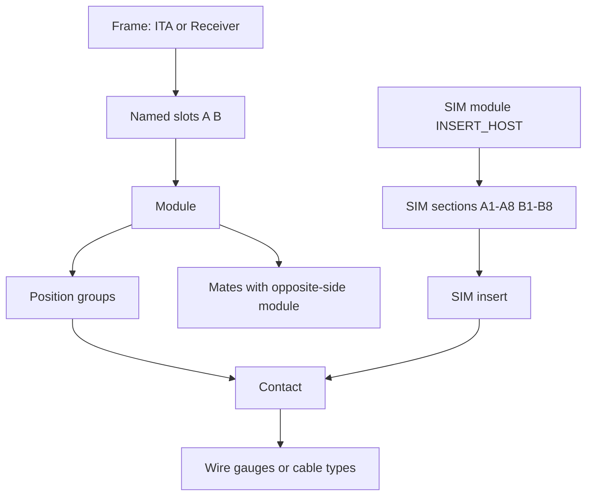

# VPC i1/iCon catalog schema and import

## Delivery sequence (required)

Work is split so **structure ships before any catalog rows**:

1. **Phase 1 — database structure in the repo.** Migration `029`, domain types, Postgres/memory stores, library API, admin UI, docs/tests. No workbook import. Catalog stays empty.
2. **Phase 2 — GitHub then Vercel.** Commit and push so Vercel deploys the new API/web. Then apply `029` to Neon (`npm run migrate` with `DATABASE_URL`). That creates empty tables only. Vercel does **not** run SQL migrations on function start; migrate is a separate step after the code is live.
3. **Phase 3 — data transfer (later).** Parser, `import:vpc-catalog`, and loading [`vpc_i1_icon_complete_database (11).xlsx`](c:\Users\meckert\Downloads\vpc_i1_icon_complete_database%20(11).xlsx). Do not start this until Phase 2 is done.

Do not commit the Neon password. Confirm with the user before any git commit/push (Phase 2) and before any Neon migrate/import.

The spreadsheet [`vpc_i1_icon_complete_database (11).xlsx`](c:\Users\meckert\Downloads\vpc_i1_icon_complete_database%20(11).xlsx) is a **product catalog**, not the CPQ manufacturing workbook. It has 104 parts and 149 compatibility rows covering the real VPC hierarchy:



Counts: 6 ITA, 4 Receiver, 29 modules, 7 SIM inserts, 58 contacts. Relationship types: `MODULE_ALLOWED`, `CONTACT_ALLOWED`, `MATES_WITH`, `INSERT_ALLOWED`, `WIRE_COMPATIBILITY`. Statuses include `CONFIRMED`, `CONFIRMED_FAMILY`, `CONDITIONAL_CLEARANCE`, `EXCLUSIVE_CONFIRMED`.

The hosted catalog is empty, so this can be a clean schema cutover on Postgres (migration `029`). Local SQLite is out of scope except keeping the in-memory/SQLite JSON store compatible so tests still pass.

## Why the current model cannot absorb this file

Today the catalog is eight fixed categories with four pairwise junction tables (`module_contact_compat`, `contact_wire_compat`, …). That is enough for a **flat cable** (module as the canvas connector, then contact and wire). It cannot store this workbook without dropping data:

- **No frame layer.** ITA/Receiver housings with `module_capacity` and slots A/B are not modules. Canvas currently treats `category === "module"` as the connector ([`apps/web/src/app/harnesses/[harnessId]/canvas/page.tsx`](apps/web/src/app/harnesses/[harnessId]/canvas/page.tsx)).
- **Compatibility is not just a pair of part IDs.** `CONTACT_ALLOWED` is scoped to pin lists (QuadraPaddle vs Mini groups on the same module). `MODULE_ALLOWED` is scoped to slots. `INSERT_ALLOWED` is scoped to SIM sections. Existing junctions have no position list.
- **`WIRE_COMPATIBILITY` is not wire SKUs.** It is gauges and media (`22,24` or `RG316,RG178`) plus an optional interface note. There are **no wire/label/backshell/splice rows** in this file.
- **New product families would force more migrations** if we add a typed junction per relationship. That is the wrong way to “handle new items.”

Do **not** revive the old EAV `library_field_definitions` model (removed in `027`). Keep typed columns for fields the app validates and displays; use an open relationship table and a small extras bag for the rest.

## Recommended structure (hybrid)

Keep class-table inheritance for engineering categories the app already uses. Add a **generic, position-scoped relationship table** so new part types and new compat rules do not need a new SQL table.

### 1. Shared fields on `parts`

Add columns used by every VPC SKU in this file (and the next one):

- `part_type` — `ITA` | `RECEIVER` | `MODULE` | `SIM_INSERT` | `CONTACT` (open text, not a hard CHECK of the full VPC taxonomy)
- `side` — `ITA` | `RECEIVER` | `DUAL`
- `notes` — free text from the PARTS sheet
- `electrical_mode` — `NONE` | `CONTACT` | `SELECTABLE` | `INSERT_HOST`

Identity stays unique `(category, part_number)` among non-archived rows. Admin create/ingest remains the path for a single new SKU; re-running the workbook import upserts by that identity.

### 2. New category `frame` (ITA + Receiver)

ITA and Receiver share the same shape. They must **not** be stored as `module`, or they will show up in the canvas connector picker.

New extension table `frames`:

- `module_capacity` (1 or 2 for i1/iCon)
- `slot_ids_json` (e.g. `["A","B"]`) derived from capacity / `MODULE_ALLOWED.parent_positions`

`part_type` distinguishes ITA vs Receiver; `side` matches.

### 3. Extend `modules` and treat SIM inserts as modules

Map workbook `MODULE` and `SIM_INSERT` both to category `module`, distinguished by `part_type`. Add:

- `position_count` (total electrical positions; populate `pin_count` from this when it is a simple module)
- `pin_ids` from the union of `CONTACT_ALLOWED.parent_positions` (this file actually lists pin IDs)
- `sim_slot_count`, `sim_slot_sections_json` (array of section arrays; SIM hosts only)
- `slot_occupancy` (how many adjacent SIM slots an insert uses)

Canvas safety: keep the connector picker on `category === "module"` **and** `partType === "MODULE"` so SIM inserts and blanks-as-inserts are not offered as top-level connectors. Frames stay out of that picker.

### 4. Extend `contacts`

Keep existing typed contact columns. Add:

- `accepted_gauges_json` — string list from `wire_gauges_awg` (`22`,`24`,`RG316`, `FLEX405`)
- `wire_interface` — `wire_cable_or_interface` when present

Do not invent `acceptedAwgMin`/`Max` from mixed coax names. Continue to fill `gender` from `side` (`ITA`/`RECEIVER`).

### 5. Generic relationship table (the important change)

Add `part_relationships` instead of four more junction tables:

| Column | Role |
| --- | --- |
| `parent_part_id` | FK → `parts` |
| `child_part_id` | FK → `parts`, **nullable** (wire-gauge rules have no child PN) |
| `relationship_type` | `MODULE_ALLOWED`, `CONTACT_ALLOWED`, `MATES_WITH`, `INSERT_ALLOWED`, `WIRE_COMPATIBILITY` (open text) |
| `position_type` | `MODULE_SLOT`, `QUADRAPADDLE`, `SIM_SLOT`, `WIRE`, … |
| `parent_positions_json` | `["A","B"]` or pin IDs |
| `status` | mapped app status `allowed` \| `forbidden` \| `review` |
| `source_status` | original workbook value (`CONDITIONAL_CLEARANCE`, …) |
| `notes` | |
| `extra_json` | gauges, interface, quantity, removable |

Explode `compatible_parts` to **one row per parent/child pair** so queries are simple. Keep the grouped workbook row in `part_import_provenance.note` if needed for audit.

Status mapping:

- `CONFIRMED`, `CONFIRMED_FAMILY`, `FAMILY_CONFIRMED`, `CONFIRMED_REVERSE`, `EXCLUSIVE_CONFIRMED` → `allowed`
- `CONDITIONAL_CLEARANCE` → `review`

Keep the existing four junction tables for current validator/CPQ code. Dual-write where the mapping is lossy-but-usable:

- `CONTACT_ALLOWED` → `module_contact_compat` (positions dropped in the old table)
- `WIRE_COMPATIBILITY` numeric AWGs → contact `accepted_gauges` (and min/max only when every value is a number)

Do **not** dual-write `MODULE_ALLOWED` / `MATES_WITH` / `INSERT_ALLOWED` into the old tables. Those are new semantics.

This is how **new items** work after this change:

- New SKU of an existing type → admin ingest or workbook row + re-import (upsert).
- New relationship type (`ACCESSORY_ALLOWED`, `COVER_INCLUDED`, …) → new `relationship_type` values, no migration.
- New part type (`i2` frame, patchcord, …) → set `part_type`; if it needs a few extra facts, put them in a JSONB `extra_attributes` on `parts` until they earn typed columns. Promote to a typed extension table only when validation or the BOM needs them.

### 6. What this file does not contain

Wires, labels, sleeves, backshells, strain reliefs, and splices are absent. A complete cable still needs those from admin entry or a later CPQ load. Do not run `import:cpq` on top of this catalog until a merge strategy exists — CPQ modules are a different grain (manufacturing matrices) and would collide on part numbers.

## Phase 3 (deferred): hosted database and data load

Not in the first implementation pass. Kept here so the later import matches the schema we ship now.

`POSTGRES_URL` and `DATABASE_URL` pointing at the same Neon pooled host **are enough to insert catalog rows** from a local script **after** Phase 1–2. This app reads `DATABASE_URL` when `STORE_BACKEND=postgres`; Vercel/Neon often also injects `POSTGRES_URL` as an alias.

## Import pipeline (deferred)

Do **not** implement `scripts/import-vpc-catalog.ts` until Phase 3. When we do, write **directly to Postgres** with the `pg` client (same pattern as [`scripts/migrate.ts`](scripts/migrate.ts)), not the HTTP ingest used by `import:cpq`.

1. Parse PARTS → in-memory parts with category mapping above.
2. Parse COMPATIBILITY → `part_relationships` + dual-write to existing junctions where applicable.
3. Dry-run: no SQL writes; print a reconciliation report (counts by `part_type`, orphan PNs, status mapping, unmapped columns).
4. Commit in one transaction: upsert `parts` + extension rows, write relationships, set `is_reviewed = true` (relationship `CONDITIONAL_CLEARANCE` stays `review`).
5. Record `import_batch_id` + `part_import_provenance` (`source_sheet` = `PARTS` / `COMPATIBILITY`).

Default file path: the Downloads workbook, overridable with `--file` / `VPC_CATALOG_XLSX_PATH`. Do not commit the xlsx or the Neon URL.

Load sequence (Phase 3 only, after migrate has already created empty tables):

```
DATABASE_URL=<neon pooled url>
npm run import:vpc-catalog -- --file "...\vpc_i1_icon_complete_database (11).xlsx"
```

The password was pasted in chat — rotate the Neon role password after this work and update Vercel env vars. Do not put the connection string in git.

## Application layers to update (Phase 1)

Postgres migration [`db/migrations/029_vpc_catalog_readiness.sql`](db/migrations/029_vpc_catalog_readiness.sql) plus:

- Domain: [`src/domain/library.ts`](src/domain/library.ts), [`src/domain/part-fields.ts`](src/domain/part-fields.ts), [`apps/web/src/lib/part-fields.ts`](apps/web/src/lib/part-fields.ts)
- Stores: [`src/infra/store/postgres-store.ts`](src/infra/store/postgres-store.ts), [`src/infra/store/memory-store.ts`](src/infra/store/memory-store.ts) (SQLite inherits memory)
- API: [`src/routes/library.ts`](src/routes/library.ts) ingest/list filters for `partType` / `side`; new `/v1/library/relationships` CRUD (admin)
- Admin: Item Database viewer columns for the new fields; compatibility manager lists the generic relationships (not only the four old junctions)
- Docs: [`docs/item-database.md`](docs/item-database.md), [`docs/roadmap.md`](docs/roadmap.md)

Validator changes that use slot/pin-scoped rules are **follow-on**. Phase 1 only needs the schema and stores to round-trip empty catalogs and admin-created items. Dual-write of workbook relationships happens in Phase 3.

## Phase 2 — GitHub / Vercel

After Phase 1 is in the working tree, commit and push (only when you ask). Vercel will deploy the new code. Then run `npm run migrate` against Neon so `029` creates empty tables. That is still structure, not data.

## Out of scope until Phase 3

- Canvas/frame authoring (place an ITA, fill slots A/B with modules, nest SIM inserts). Catalog will be ready; the snapshot `Connector` type is still module-as-node.
- BOM explosion of frame → modules via `part_components` (table exists, unused).
- CPQ merge / wire-SKU catalog.
- Parsing amp/plating out of contact descriptions (keep `description`; structured AWG comes from the COMPATIBILITY sheet).

## Mapping cheat sheet

- `ITA` / `RECEIVER` → category `frame`
- `MODULE` / `SIM_INSERT` → category `module` (`part_type` distinguishes)
- `CONTACT` → category `contact`
- `active=True` → `isActive`
- `MODULE_ALLOWED` → `part_relationships` (frame → module, slots)
- `CONTACT_ALLOWED` → relationships (module → contact, pin group) + coarse `module_contact_compat`
- `MATES_WITH` → relationships only (ITA module ↔ Receiver module, or special contact pairs)
- `INSERT_ALLOWED` → relationships (SIM host → insert, section)
- `WIRE_COMPATIBILITY` → contact `accepted_gauges` / `wire_interface` + relationship row with null child
